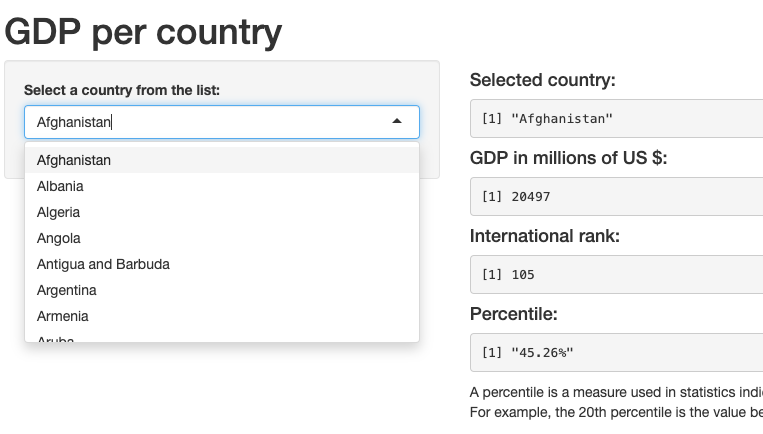

Gross Domestic Product per Country
========================================================
author: Lisa Halmschlager 
date: July 8, 2019
autosize: true

Introduction
========================================================

I created a shiny application that allows the user to find out the GDP in million USD for a country of choice.

The application features an input widget to select the country of interest.

Data Source
========================================================

The original data sources can be found here:
http://data.worldbank.org/data-catalog/GDP-ranking-table

The download link is as follows: 
https://d396qusza40orc.cloudfront.net/getdata%2Fdata%2FGDP.csv

Data Summary
========================================================


```r
GDP_dataset <- read.csv(URL_GDP, header = FALSE, stringsAsFactors=FALSE)
str(GDP_dataset)
```

```
'data.frame':	331 obs. of  10 variables:
 $ V1 : chr  "" "" "" "" ...
 $ V2 : chr  "Gross domestic product 2012" "" "" "Ranking" ...
 $ V3 : logi  NA NA NA NA NA NA ...
 $ V4 : chr  "" "" "" "Economy" ...
 $ V5 : chr  "" "" "(millions of" "US dollars)" ...
 $ V6 : chr  "" "" "" "" ...
 $ V7 : logi  NA NA NA NA NA NA ...
 $ V8 : logi  NA NA NA NA NA NA ...
 $ V9 : logi  NA NA NA NA NA NA ...
 $ V10: logi  NA NA NA NA NA NA ...
```

GDPApp
========================================================



GDP App
========================================================

Have fun trying it out yourself:

https://lisahlmsch.shinyapps.io/GDPApp/
